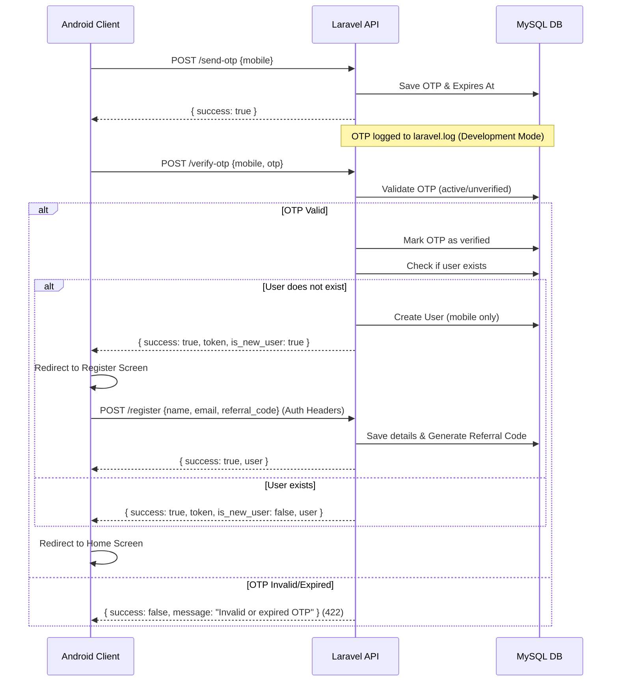

# Chetak Pay API Documentation (v1)

Welcome to the Chetak Pay Backend API documentation. This document covers the authentication and profile endpoints implemented in Phase 1.

## General Information

*   **Production Base URL**: `https://api.chetakpay.com/api/v1`
*   **Local/Development URL**: `http://127.0.0.1:8000/api/v1`
*   **Default Headers**:
    ```http
    Accept: application/json
    Content-Type: application/json
    ```

---

## Standard Response Format

Every API response follows a consistent wrapper structure.

### Success Response
```json
{
  "success": true,
  "message": "Response message.",
  "data": {}
}
```

### Error Response (e.g., 400, 401, 403, 404, 500)
```json
{
  "success": false,
  "message": "Error description.",
  "data": {}
}
```

### Validation Error Response (422)
```json
{
  "success": false,
  "message": "The given data was invalid.",
  "data": {
    "errors": {
      "field_name": [
        "Specific error message."
      ]
    }
  }
}
```

---

## Authentication Flow



---

## Authentication Endpoints

### 1. Send OTP
Generate and send a 6-digit OTP to the user's mobile number.

*   **URL**: `/send-otp`
*   **Method**: `POST`
*   **Auth Required**: No

#### Request Body
```json
{
  "mobile": "9876543210"
}
```
*   `mobile` (string, required): A 10 to 15 digit mobile number.

#### Response (200 OK)
```json
{
  "success": true,
  "message": "OTP sent successfully.",
  "data": {}
}
```

> [!NOTE]
> In local/development environment, the OTP will be written to `storage/logs/laravel.log`. If the `DEV_OTP` is set in the `.env` (e.g., `123456`), it will use that constant.

---

### 2. Verify OTP
Verify the OTP sent to the user and obtain an API access token.

*   **URL**: `/verify-otp`
*   **Method**: `POST`
*   **Auth Required**: No

#### Request Body
```json
{
  "mobile": "9876543210",
  "otp": "123456"
}
```
*   `mobile` (string, required): 10 to 15 digit mobile number.
*   `otp` (string, required): Exactly 6 digit OTP.

#### Response (200 OK - New User)
If the user's mobile number is registering for the first time, `is_new_user` will be `true`. The Android app must navigate the user to the Registration/Profile setup screen.
```json
{
  "success": true,
  "message": "OTP verified successfully.",
  "data": {
    "token": "1|sanctum_generated_token_value_here",
    "is_new_user": true,
    "user": {
      "id": 5,
      "mobile": "9876543210",
      "name": null,
      "email": null,
      "referral_code": null,
      "referred_by": null,
      "wallet_balance": "0.00",
      "total_investment": "0.00",
      "total_commission": "0.00",
      "total_withdrawn": "0.00",
      "created_at": "2026-06-10T09:30:00.000000Z",
      "updated_at": "2026-06-10T09:30:00.000000Z"
    }
  }
}
```

#### Response (200 OK - Existing User)
If the user already exists and has fully registered, `is_new_user` will be `false`.
```json
{
  "success": true,
  "message": "OTP verified successfully.",
  "data": {
    "token": "2|sanctum_generated_token_value_here",
    "is_new_user": false,
    "user": {
      "id": 1,
      "mobile": "9876543210",
      "name": "John Doe",
      "email": "johndoe@example.com",
      "referral_code": "CPABCD12",
      "referred_by": null,
      "wallet_balance": "1500.00",
      "total_investment": "10000.00",
      "total_commission": "2500.00",
      "total_withdrawn": "1000.00",
      "created_at": "2026-05-15T08:00:00.000000Z",
      "updated_at": "2026-06-10T09:30:00.000000Z"
    }
  }
}
```

---

### 3. Complete Registration
Set user profile details (name, email) and link referral code on first login.

*   **URL**: `/register`
*   **Method**: `POST`
*   **Auth Required**: Yes (Bearer Token)

#### Request Body
```json
{
  "name": "John Doe",
  "email": "johndoe@example.com",
  "referral_code": "CPREF123"
}
```
*   `name` (string, required): User's full name.
*   `email` (string, nullable): User's email address.
*   `referral_code` (string, nullable): Referral code of the user who invited them. Must exist in the system.

#### Response (200 OK)
Returns the completed user profile with their newly generated, unique referral code.
```json
{
  "success": true,
  "message": "Registration completed successfully.",
  "data": {
    "user": {
      "id": 5,
      "mobile": "9876543210",
      "name": "John Doe",
      "email": "johndoe@example.com",
      "referral_code": "CPXYZ789",
      "referred_by": 1,
      "wallet_balance": "0.00",
      "total_investment": "0.00",
      "total_commission": "0.00",
      "total_withdrawn": "0.00",
      "created_at": "2026-06-10T09:30:00.000000Z",
      "updated_at": "2026-06-10T09:32:00.000000Z"
    }
  }
}
```

---

## User Profile Endpoints

### 4. Get User Profile
Retrieve the profile details of the authenticated user.

*   **URL**: `/profile`
*   **Method**: `GET`
*   **Auth Required**: Yes (Bearer Token)

#### Response (200 OK)
```json
{
  "success": true,
  "message": "Profile retrieved successfully.",
  "data": {
    "user": {
      "id": 5,
      "mobile": "9876543210",
      "name": "John Doe",
      "email": "johndoe@example.com",
      "referral_code": "CPXYZ789",
      "referred_by": 1,
      "wallet_balance": "0.00",
      "total_investment": "0.00",
      "total_commission": "0.00",
      "total_withdrawn": "0.00",
      "created_at": "2026-06-10T09:30:00.000000Z",
      "updated_at": "2026-06-10T09:32:00.000000Z"
    }
  }
}
```

---

### 5. Logout
Revoke the API token currently in use.

*   **URL**: `/logout`
*   **Method**: `POST`
*   **Auth Required**: Yes (Bearer Token)

#### Response (200 OK)
```json
{
  "success": true,
  "message": "Logged out successfully.",
  "data": {}
}
```
